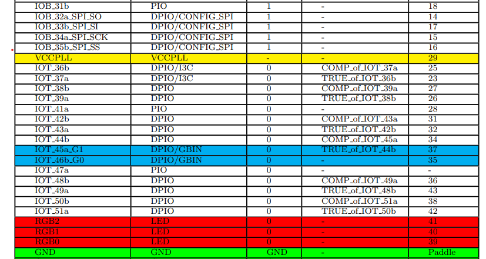

# TASK-1: Understanding and Implementing the Verilog Code on FM

## STEP-1 Understanding the Verilog Code:

### **1. Access the Verilog code:**
[Verilog Code link](https://github.com/thesourcerer8/VSDSquadron_FM/blob/main/led_blue/top.v)

### **2. Reviewing the module declaration and understanding the purpose of each input and output port:**
+ **led_red, led_blue, led_green (Output)**:
 
  The signals (registers or wires) that regulate an RGB LED's red, blue, and green channels are commonly referred to as ``led_red``, ``led_blue``, and ``led_green`` in Verilog code.
  These signals are used to drive each channel with the proper value in order to determine the colour and intensity of the LED. Setting a signal to 1 turns the respective color on, while 0 turns it off.  
  ``(1, 0, 0)`` → Red  
  ``(0, 1, 0)`` → Green  
  ``(0, 0, 1)`` → Blue  
  ``(1, 1, 0)`` → Yellow  
  ``(1, 1, 1)`` → White
+ **hw_clk (Input)**:
 
  ``hw_clk`` (hardware clock) is an input signal that provides a steady timing pulse to your hardware design in Verilog. It acts like a heartbeat that keeps everything synchronized. It ensures that operations happen at a consistent rate. It helps coordinate data movement and processing.

+ **testwire (Output)**:
  In simple terms, testwire (output) is a signal in Verilog that sends data or status information from your module to the outside world. It is typically used for debugging, monitoring, or connecting to other parts of the design.

### **3. Analyze the internal components:**

+ **Internal Oscillator (SB_HFOSC) instantiation:**  
  The SB_HFOSC is an internal high-frequency oscillator used in Lattice FPGAs. It provides a built-in clock signal without needing an external crystal or oscillator. An oscillator is a circuit that generates a continuous, repetitive signal, usually in the form of a clock pulse.
  Control Signals:
    CLKHFPU = 1'b1 : Enables power-up
    CLKHFEN = 1'b1 : Enables oscillator
    CLKHF : Output connected to internal int_osc signal
  
+ **Frequency counter logic driven by the internal oscillator:**
  
  A frequency counter measures the frequency of an input signal by counting how many pulses occur within a fixed time period.
  
+ **RGB LED driver instantiation with defined current parameters:**  
  An RGB LED driver controls the brightness and color of an RGB LED by adjusting the current for each color channel (Red, Green, and Blue).
  Configuration:
    + RGBLEDEN = 1'b1 : Enables LED operation
    + RGB0PWM = 1'b0 : Red LED minimum brightness
    + RGB1PWM = 1'b0 : Green LED minimum brightness
    + RGB2PWM = 1'b1 : Blue LED maximum brightness
    + CURREN = 1'b1 : Enables current control
 
 ### **4. Creating a brief documentation explaining the functionality of the Verilog code:** 
 + **Purpose**  
  An RGB LED controller with intrinsic timing capabilities is implemented by this Verilog module.  It controls RGB LED outputs and offers a reliable internal clock source, all while preserving testability using a separate test signal.  With integrated timing and testing features, it offers a comprehensive RGB LED control solution and is appropriate for embedded systems that need reliable LED operation with few external dependencies.
+ **Description of internal logic and oscillator:**
The internal timing source of the module is a high-frequency oscillator (SB_HFOSC).  A 28-bit frequency counter, which provides a test signal and timing information, is driven by the oscillator's output.  For external monitoring, bit 5 of the counter is sent to the testwire output.
+ **Functionality of the RGB LED driver and its relationship to the outputs:**
  The RGB LED driver (SB_RGBA_DRV) controls LED outputs with the following characteristics:  
   + Minimum current setting for current-controlled outputs ("0b000001")  
   + Each colour channel's pulse width modulation (PWM) control  
   + Fixed setup: maximum brightness blue LED (RGB2PWM = 1'b1)  
   + Lowest brightness red and green LEDs (RGB0PWM = RGB1PWM = 1'b0)  

## STEP-1 Understanding the Verilog Code:  

### **1. Accessing the PCL file:**
[PCL file link](https://github.com/thesourcerer8/VSDSquadron_FM/blob/main/led_blue/VSDSquadronFM.pcf)  

### **2. Understanding the pin assignments from the PCF file:**
+ This snippet is used in FPGA constraint files to assign physical pins to signals in Verilog design.
+ ``set_io led_red 39`` ==>  Maps led_red signal to pin 39 allowing the HDL code to control a LED (color red is implied).
+ ``set_io led_red 40`` ==>  Maps led_red signal to pin 40.
+ ``set_io led_red 41`` ==>  Maps hw_clk (hardware clock input) to pin 20 allowing the HDL code to recieve clock inputs through pin 20.
+ ``set_io hw_clk 20`` ==>  Maps led_red signal to pin 42.
+ ``set_io testwire 17`` ==>  Maps testwire (output signal) to pin 17 for testing or debugging purposes.

### **3. Verifying the correctness of the assignments:**

## **Step 3: Integrating with the VSDSquadron FPGA Mini Board**

[Datasheet file link](https://www.vlsisystemdesign.com/wp-content/uploads/2025/01/VSDSquadronFMDatasheet.pdf)  
# Steps to Follow:  
1. Reviewing the VSDSquadron FPGA Mini board datasheet to understand its features and pinout.    
2. Using the datasheet to correlate the physical board connections with the PCF file and Verilog code.  
3. Connecting the board to the computer as described in the datasheet (e.g., using USB-C and ensuring FTDI connection).  
4. Following the Makefile for building and flashing the Verilog code:  
Run ``make clean`` to clear any previous builds.  
Run ``make build`` to compile the design.  
Run ``sudo make flash`` to program the FPGA board.
After running ``make clean``, the board should like this: 

https://github.com/user-attachments/assets/befa65dd-69d1-4808-85a6-0e1df87e6657
## Challenges faced and solutions implemented:
+ Found it difficult to understand Verilog code, certain websites were able to explain this easily.

